# 系统全流程图（Flow Map）

> 覆盖后端 133 个类 / 23 个端点 / 5 类存储与全部降级出口的**执行路径**。
> 方法级作用说明见 [method-map.md](method-map.md)（逐类逐方法清单）。
> 图中 `⚠` = 降级出口（吞异常后继续服务），`★` = 本会话内新增/修正过的关键闸门。
> 文件路径均相对 `src/main/java/com/ai/`。

---

## 0. 图例

| 记号 | 含义 |
|---|---|
| 方框 `[...]` | 一个组件/方法的动作 |
| 菱形 `{...}` | 分支判定 |
| `⚠` | 外部依赖故障时的降级出口（绝不影响主流程） |
| `★` | 正确性闸门（缓存串味防护、审计不变式等） |
| `异步` | 事件驱动或线程池执行，不占请求线程 |
| 编号 ①②③ | 与后文小节里的"分步说明"一一对应 |

---

## 1. 全景：一次请求会流经哪些层

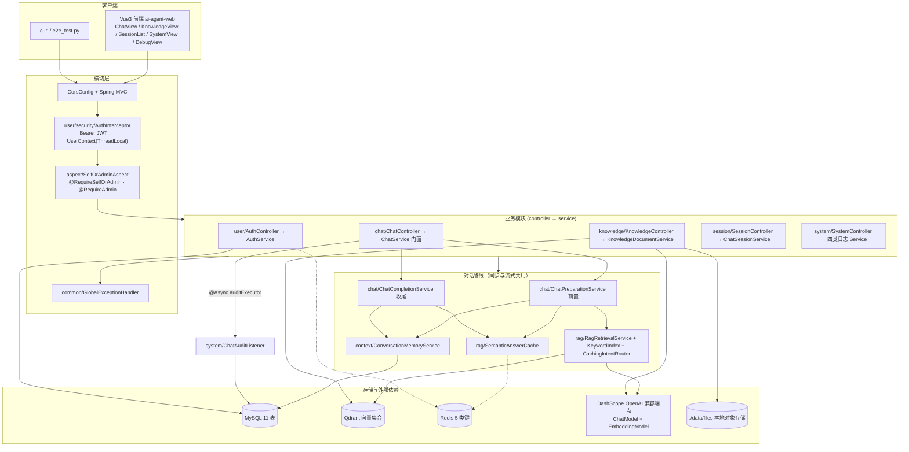
```mermaid
flowchart TD
    subgraph CL["客户端"]
        WEB["Vue3 前端 ai-agent-web<br/>ChatView / KnowledgeView / SessionList / SystemView / DebugView"]
        CURL["curl / e2e_test.py"]
    end

    subgraph EDGE["横切层"]
        CORS["CorsConfig + Spring MVC"]
        AI["user/security/AuthInterceptor<br/>Bearer JWT → UserContext(ThreadLocal)"]
        ASPECT["aspect/SelfOrAdminAspect<br/>@RequireSelfOrAdmin · @RequireAdmin"]
        EXH["common/GlobalExceptionHandler"]
    end

    subgraph APP["业务模块 (controller → service)"]
        AUTH["user/AuthController → AuthService"]
        CHAT["chat/ChatController → ChatService 门面"]
        KN["knowledge/KnowledgeController → KnowledgeDocumentService"]
        SES["session/SessionController → ChatSessionService"]
        SYS["system/SystemController → 四类日志 Service"]
    end

    subgraph PIPE["对话管线（同步与流式共用）"]
        PREP["chat/ChatPreparationService 前置"]
        COMP["chat/ChatCompletionService 收尾"]
        MEM["context/ConversationMemoryService"]
        RAG["rag/RagRetrievalService + KeywordIndex + CachingIntentRouter"]
        CACHE["rag/SemanticAnswerCache"]
    end

    subgraph STORE["存储与外部依赖"]
        MYSQL[("MySQL 11 表")]
        QDRANT[("Qdrant 向量集合")]
        REDIS[("Redis 5 类键")]
        LLM["DashScope OpenAI 兼容端点<br/>ChatModel + EmbeddingModel"]
        DISK[("./data/files 本地对象存储")]
    end

    WEB --> CORS --> AI
    CURL --> CORS
    AI --> ASPECT --> APP
    APP --> PIPE
    CHAT --> PREP --> RAG
    PREP --> CACHE
    CACHE -.-> REDIS
    RAG --> QDRANT
    RAG --> LLM
    PREP --> MEM
    MEM --> MYSQL
    CHAT --> COMP --> MEM
    COMP --> CACHE
    CHAT -->|"@Async auditExecutor"| AUDIT["system/ChatAuditListener"]
    AUDIT --> MYSQL
    KN --> DISK
    KN --> QDRANT
    KN --> LLM
    AUTH --> MYSQL
    AUTH -.-> REDIS
    APP --> EXH
```

**要点**

1. `ChatService` 只做门面（会话校验 / 并发名额 / 请求链构建 / 同步与 SSE 编排）；**前置与收尾各一份实现**，同步与流式共用——这是本项目最重要的一条结构性约束。
2. 所有外部依赖（模型、Qdrant、Redis、MySQL）都有 `⚠` 出口；对话主链路从不因旁路组件故障而 500。
3. 审计是**异步事件**（`ChatDecisionEvent` / `ChatCompletedEvent` → `auditExecutor` 线程池 → `ChatAuditListener` 落库），所以日志表计数需要给异步留出时间（e2e 断言已考虑）。

---

## 2. 端点总表 → 落地方法

| # | 方法与路径 | 鉴权 | 落地方法 |
|---|---|---|---|
| 1 | `POST /api/auth/register` | 匿名 | `AuthController.register → AuthService.register` |
| 2 | `POST /api/auth/login` | 匿名（受限流） | `AuthController.login → AuthService.login` |
| 3 | `POST /api/auth/logout` | JWT | `AuthController.logout → AuthService.logout → TokenBlacklistService.ban` |
| 4 | `GET /api/auth/me` | JWT | `AuthController.me → AuthService.me` |
| 5 | `POST /api/ai/chat` | JWT | `ChatController.chat → ChatService.chat` |
| 6 | `POST /api/ai/chat/stream` | JWT | `ChatController.chatStream → ChatService.chatStream`（SSE） |
| 7 | `POST /api/ai/rag/search` | JWT | `ChatController.ragSearch → ChatService.debugRetrieve` |
| 8 | `POST /api/knowledge/upload` | JWT（**无角色限制**，见 §22） | `KnowledgeController.upload → KnowledgeDocumentService.upload` |
| 9 | `POST /api/knowledge/upload/batch` | JWT（同上） | `KnowledgeController.uploadBatch → uploadBatch` |
| 10 | `GET /api/knowledge/documents` | JWT | `KnowledgeController.listDocuments → listDocuments` |
| 11 | `DELETE /api/knowledge/documents/{id}` | `@RequireAdmin`（挂在 **Service** `KnowledgeDocumentService:183`） | `KnowledgeController.deleteDocument → deleteDocument` |
| 12 | `POST /api/knowledge/documents/{id}/reprocess` | `@RequireAdmin`（挂在 **Service** `:204`） | `KnowledgeController.reprocess → reprocess` |
| 13 | `POST /api/sessions` | JWT | `SessionController.create → ChatSessionService.create` |
| 14 | `GET /api/sessions` | JWT（数据隔离靠 Service 按 `userId` 过滤） | `SessionController.list → ChatSessionService.list` |
| 15 | `GET /api/sessions/{id}/messages` | JWT + Service `requireOwned` | `SessionController.messages → listMessages` |
| 16 | `PUT /api/sessions/{id}/archive` | JWT + Service `requireOwned` | `SessionController.archive → archive` |
| 17 | `DELETE /api/sessions/{id}` | JWT + Service `requireOwned` | `SessionController.delete → delete` |
| 18 | `GET /api/sessions/{id}` | JWT + Service `requireOwned` | `SessionController.detail → detail`（前端首轮后刷新自动标题） |
| 19 | `PUT /api/sessions/{id}/title` | JWT + Service `requireOwned` | `SessionController.rename → rename`（人工名优先，不被自动标题覆盖） |
| 20 | `GET /api/system/chat-logs` | `@RequireSelfOrAdmin` | `SystemController.listChatLogs → ChatLogService.list` |
| 21 | `GET /api/system/tool-call-logs` | `@RequireSelfOrAdmin` | `SystemController.listToolCallLogs → ToolCallLogService.list` |
| 22 | `GET /api/system/rag-decisions` | `@RequireSelfOrAdmin` | `SystemController.listRagDecisions → RagDecisionLogService.list` |
| 23 | `GET /api/system/context-logs` | `@RequireSelfOrAdmin` | `SystemController.listContextLogs → ContextLogService.list` |
| 24 | `DELETE /api/system/semantic-cache` | `@RequireAdmin` | `SystemController.clearSemanticCache → SemanticAnswerCache.evictAll` |
| 25 | `DELETE /api/system/intent-cache` | `@RequireAdmin` | `SystemController.clearIntentCache → CachingIntentRouter.evictAll` |

（注册/登录在 `AuthInterceptor` 内部按路径放行；`X-User-Id` 模拟登录仅 dev profile 且默认关闭。）

---

## 3. 启动与装配（顺序即执行序）

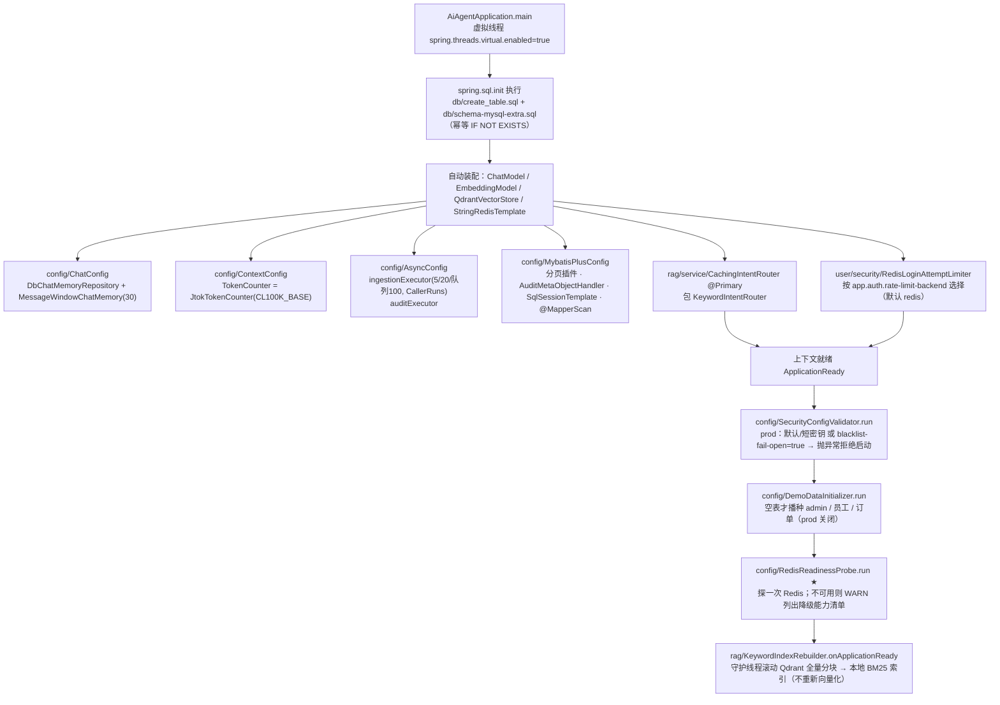
```mermaid
flowchart TD
    S0["AiAgentApplication.main<br/>虚拟线程 spring.threads.virtual.enabled=true"] --> S1["spring.sql.init 执行<br/>db/create_table.sql + db/schema-mysql-extra.sql（幂等 IF NOT EXISTS）"]
    S1 --> S2["自动装配：ChatModel / EmbeddingModel / QdrantVectorStore / StringRedisTemplate"]
    S2 --> S3["config/ChatConfig<br/>DbChatMemoryRepository + MessageWindowChatMemory(30)"]
    S2 --> S4["config/ContextConfig<br/>TokenCounter = JtokTokenCounter(CL100K_BASE)"]
    S2 --> S5["config/AsyncConfig<br/>ingestionExecutor(5/20/队列100, CallerRuns)<br/>auditExecutor"]
    S2 --> S6["config/MybatisPlusConfig<br/>分页插件 · AuditMetaObjectHandler · SqlSessionTemplate · @MapperScan"]
    S2 --> S7["rag/service/CachingIntentRouter @Primary<br/>包 KeywordIntentRouter"]
    S2 --> S8["user/security/RedisLoginAttemptLimiter<br/>按 app.auth.rate-limit-backend 选择（默认 redis）"]
    S7 --> S9["上下文就绪 ApplicationReady"]
    S8 --> S9
    S9 --> R1["config/SecurityConfigValidator.run<br/>prod：默认/短密钥 或 blacklist-fail-open=true → 抛异常拒绝启动"]
    R1 --> R2["config/DemoDataInitializer.run<br/>空表才播种 admin / 员工 / 订单（prod 关闭）"]
    R2 --> R3["config/RedisReadinessProbe.run ★<br/>探一次 Redis；不可用则 WARN 列出降级能力清单"]
    R3 --> R4["rag/KeywordIndexRebuilder.onApplicationReady<br/>守护线程滚动 Qdrant 全量分块 → 本地 BM25 索引（不重新向量化）"]
```

**为什么 `ChatClient` 不在配置类里 `@ConditionalOnBean` 建**：用户配置类的处理早于自动配置，条件永不成立会导致对话全部降级（实测踩坑）。改为 `ChatClientProvider` 运行时惰性取 `ChatModel` 并缓存；它同时是**模型名单一事实来源** `modelLabel()`。

---

## 4. 鉴权横切链（每个 /api/** 请求）

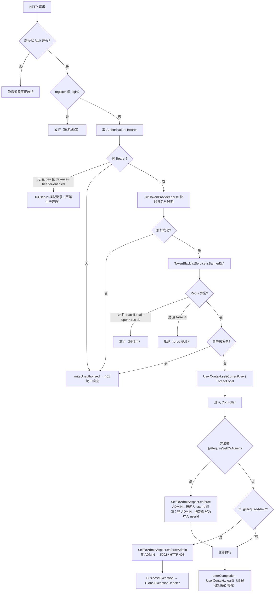
```mermaid
flowchart TD
    E0["HTTP 请求"] --> E1{"路径以 /api/ 开头?"}
    E1 -->|否| EPASS["静态资源直接放行"]
    E1 -->|是| E2{"register 或 login?"}
    E2 -->|是| EOK1["放行（匿名端点）"]
    E2 -->|否| E3["取 Authorization: Bearer"]
    E3 --> E4{"有 Bearer?"}
    E4 -->|无 且 dev 且 dev-user-header-enabled| E5["X-User-Id 模拟登录（严禁生产开启）"]
    E4 -->|无| E401["writeUnauthorized → 401 统一响应"]
    E4 -->|有| E6["JwtTokenProvider.parse 校验签名与过期"]
    E6 --> E7{"解析成功?"}
    E7 -->|否| E401
    E7 -->|是| E8["TokenBlacklistService.isBanned(jti)"]
    E8 --> E9{"Redis 异常?"}
    E9 -->|是 且 blacklist-fail-open=true ⚠| E10["放行（保可用）"]
    E9 -->|是 且 false ⚠| E11["拒绝（prod 基线）"]
    E9 -->|否| E12{"命中黑名单?"}
    E12 -->|是| E401
    E12 -->|否| E13["UserContext.set(CurrentUser) ThreadLocal"]
    E13 --> E14["进入 Controller"]
    E14 --> E15{"方法带 @RequireSelfOrAdmin?"}
    E15 -->|是| E16["SelfOrAdminAspect.enforce<br/>ADMIN→按传入 userId 过滤；非 ADMIN→强制改写为本人 userId"]
    E15 -->|否| E17{"带 @RequireAdmin?"}
    E17 -->|是| E18["SelfOrAdminAspect.enforceAdmin<br/>非 ADMIN → 5002 / HTTP 403"]
    E17 -->|否| E19["业务执行"]
    E16 --> E19
    E18 --> ERR["BusinessException → GlobalExceptionHandler"]
    E19 --> E20["afterCompletion: UserContext.clear()（线程池复用必须清）"]
```

---

## 5. 认证用例（注册 / 登录 / 注销）

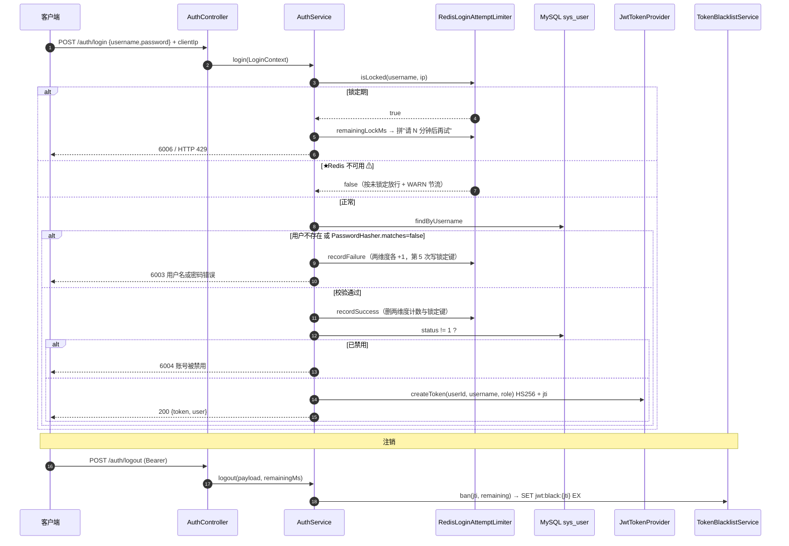
```mermaid
sequenceDiagram
    autonumber
    participant C as 客户端
    participant AC as AuthController
    participant AS as AuthService
    participant LL as RedisLoginAttemptLimiter
    participant DB as MySQL sys_user
    participant JP as JwtTokenProvider
    participant BL as TokenBlacklistService

    C->>AC: POST /auth/login {username,password} + clientIp
    AC->>AS: login(LoginContext)
    AS->>LL: isLocked(username, ip)
    alt 锁定期
        LL-->>AS: true
        AS->>LL: remainingLockMs → 拼"请 N 分钟后再试"
        AS-->>C: 6006 / HTTP 429
    else ★Redis 不可用 ⚠
        LL-->>AS: false（按未锁定放行 + WARN 节流）
    else 正常
        AS->>DB: findByUsername
        alt 用户不存在 或 PasswordHasher.matches=false
            AS->>LL: recordFailure（两维度各 +1，第 5 次写锁定键）
            AS-->>C: 6003 用户名或密码错误
        else 校验通过
            AS->>LL: recordSuccess（删两维度计数与锁定键）
            AS->>DB: status != 1 ?
            alt 已禁用
                AS-->>C: 6004 账号被禁用
            else
                AS->>JP: createToken(userId, username, role) HS256 + jti
                AS-->>C: 200 {token, user}
            end
        end
    end
    Note over C,BL: 注销
    C->>AC: POST /auth/logout (Bearer)
    AC->>AS: logout(payload, remainingMs)
    AS->>BL: ban(jti, remaining) → SET jwt:black:{jti} EX
```

---

## 6. 知识库上传与异步入库

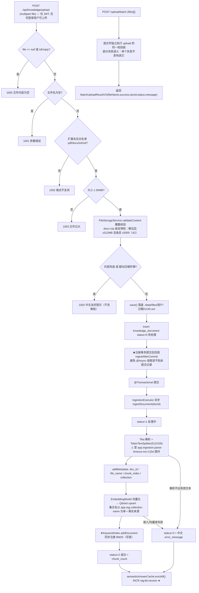
```mermaid
flowchart TD
    U0["POST /api/knowledge/upload (multipart file) — 仅 JWT, 任何登录用户可上传"] --> U1{"file == null 或 isEmpty?"}
    U1 -->|是| U1E["1005 文件内容为空"]
    U1 -->|否| U2{"文件名为空?"}
    U2 -->|是| U2E["1001 参数错误"]
    U2 -->|否| U3{"扩展名在白名单 pdf/docx/txt/md?"}
    U3 -->|否| U3E["1002 格式不支持"]
    U3 -->|是| U4{"大小 ≤ 50MB?"}
    U4 -->|否| U4E["1003 文件过大"]
    U4 -->|是| U5["FileStorageService.validateContent 魔数校验<br/>docx=zip 条目预检：解压后 ≤512MB 且条目 ≤5000（A2）"]
    U5 --> U5E{"内容伪造 或 疑似压缩炸弹?"}
    U5E -->|是| U5F["1002 中文友好提示（不含堆栈）"]
    U5E -->|否| U6["save() 落盘 ./data/files/用户/日期/UUID.ext"]
    U6 --> U7["insert knowledge_document status=0 待处理"]
    U7 --> U8["★注册事务提交后回调 ingestAfterCommit<br/>避免 @Async 线程读不到未提交记录"]
    U8 --> U9["@Transactional 提交"]
    U9 --> U10["ingestionExecutor 异步 ingestDocument(docId)"]

    U10 --> V1["status=1 处理中"]
    V1 --> V2["Tika 解析 + TokenTextSplitter(512/100)<br/>⚠ 受 app.ingestion.parse-timeout-ms=120s 限时"]
    V2 --> V3["addMetadata: doc_id / file_name / chunk_index / collection"]
    V3 --> V4["EmbeddingModel 向量化 → Qdrant upsert<br/>集合名以 app.rag.collection-name 为单一事实来源"]
    V4 --> V5["★KeywordIndex.addDocument 同步注册 BM25（写锁）"]
    V5 --> V6["status=2 成功 + chunk_count"]
    V2 -->|"解析不出有效文本"| VE["status=3 + 中文 error_message"]
    V4 -->|"嵌入/向量库失败"| VE
    V6 --> V7["semanticAnswerCache.evictAll() INCR rag:kb:version ★"]
    VE --> V7

    B0["POST /upload/batch (files[])"] --> B1["逐文件独立执行 upload 的同一校验链<br/>部分失败语义：单个失败不影响其它"]
    B1 --> B2["返回 BatchUploadResultVO(fileName,success,docId,status,message)"]
```

### 6.1 文档状态机

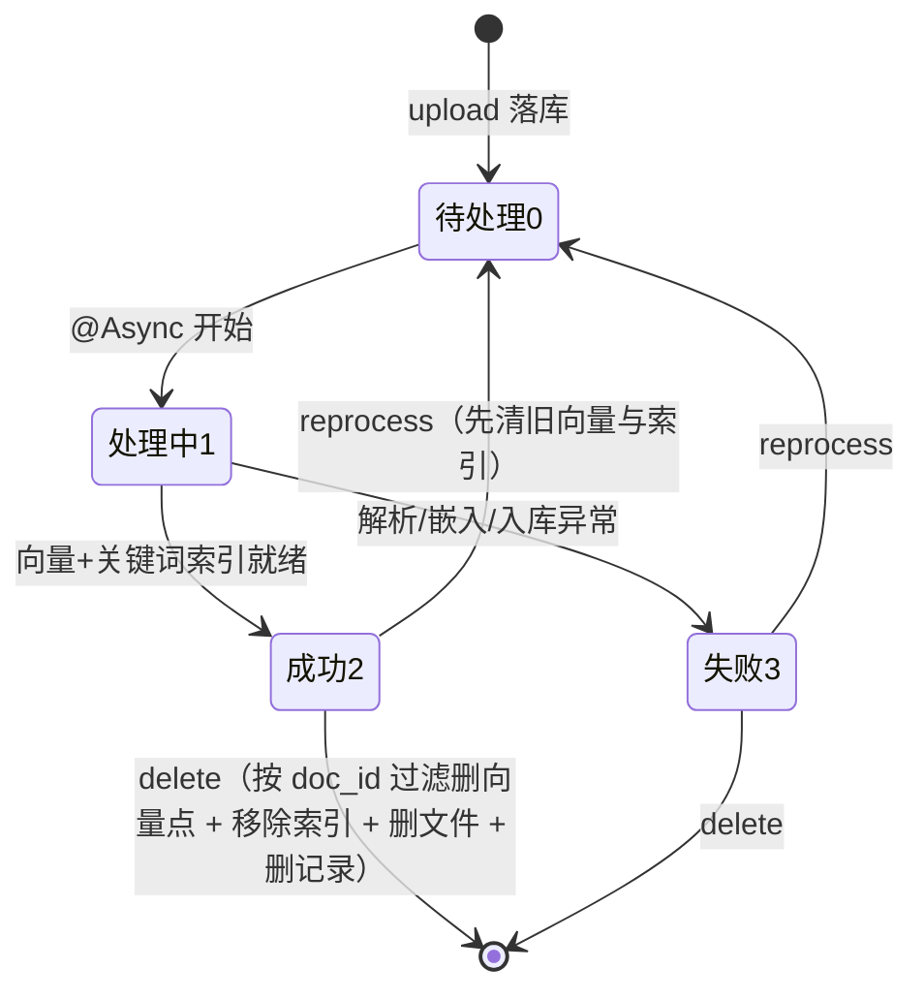
```mermaid
stateDiagram-v2
    [*] --> 待处理0: upload 落库
    待处理0 --> 处理中1: @Async 开始
    处理中1 --> 成功2: 向量+关键词索引就绪
    处理中1 --> 失败3: 解析/嵌入/入库异常
    成功2 --> 待处理0: reprocess（先清旧向量与索引）
    失败3 --> 待处理0: reprocess
    成功2 --> [*]: delete（按 doc_id 过滤删向量点 + 移除索引 + 删文件 + 删记录）
    失败3 --> [*]: delete
```

---

## 7. 删除与重新处理（管理员动作）

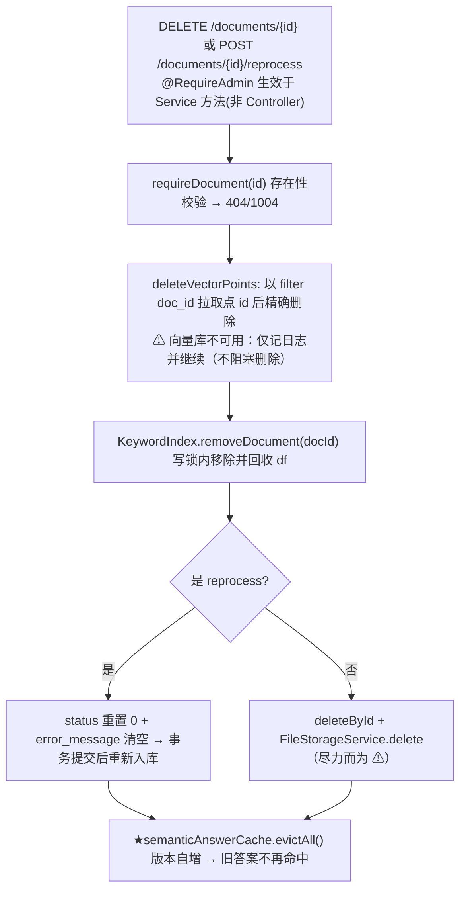
```mermaid
flowchart TD
    D0["DELETE /documents/{id} 或 POST /documents/{id}/reprocess<br/>@RequireAdmin 生效于 Service 方法(非 Controller)"] --> D1["requireDocument(id) 存在性校验 → 404/1004"]
    D1 --> D2["deleteVectorPoints: 以 filter doc_id 拉取点 id 后精确删除<br/>⚠ 向量库不可用：仅记日志并继续（不阻塞删除）"]
    D2 --> D3["KeywordIndex.removeDocument(docId) 写锁内移除并回收 df"]
    D3 --> D4{"是 reprocess?"}
    D4 -->|是| D5["status 重置 0 + error_message 清空 → 事务提交后重新入库"]
    D4 -->|否| D6["deleteById + FileStorageService.delete（尽力而为 ⚠）"]
    D5 --> D7["★semanticAnswerCache.evictAll() 版本自增 → 旧答案不再命中"]
    D6 --> D7
```

---

## 8. 对话主链路 ① 前置阶段（`ChatPreparationService.prepare`）

同步 `chat()` 与流式 `chatStream()` **共用**这张图，这是"两条管线不得漂移"的实现点。

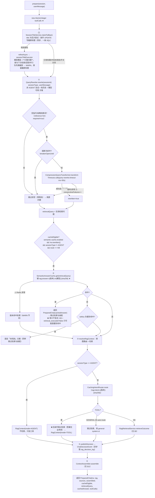
```mermaid
flowchart TD
    P0["prepare(session, userMessage)"] --> P1["new AtomicInteger toolCalls ★"]
    P1 --> P1a["⓪ SessionTitleService.claimFallback<br/>title 为空才尝试：条件 UPDATE 写截断标题（同步、一条 SQL）"]
    P1a -->|抢到首轮| P1b["refineAsync → sessionTitleExecutor<br/>模型概括（**只需问题**，故与下方检索/回答并行）<br/>队列满被拒 → WARN，保留截断标题"]
    P1a -->|已有标题/并发未抢到/开关关闭| P2
    P1b --> P2["① QueryRewriter.rewrite(sessionId, sessionType, userMessage)<br/>非 AGENT 会话 + 有历史 + 模型可用 才做"]
    P2 --> P2a{"含指代/省略线索词?<br/>（reference-hint-required=true）"}
    P2a -->|否| P2b["跳过改写（零等待）→ 用原问题"]
    P2a -->|是| P2c{"熔断冷却中?<br/>breakerOpenUntil"}
    P2c -->|是| P2b
    P2c -->|否| P2d["CompressionQueryTransformer.transform<br/>Timeouts.call(query-rewrite.timeout-ms=30s)"]
    P2d -->|成功且≠原问题| P2e["rewritten=true"]
    P2d -->|"超时/异常 ⚠ consecutiveFailures++"| P2b
    P2e --> P3
    P2b --> P3["retrievalQuery = 生效检索问题"]
    P3 --> P4{"cacheEligible?<br/>semantic-cache.enabled && !rw.rewritten()<br/>&& sessionType != AGENT && route == KB"}
    P4 -->|是| P5["② SemanticAnswerCache.get(retrievalQuery)<br/>键 rag:answer:v{版本}:m{模型}:{sha256} ★"]
    P5 -->|⚠ Redis 异常| P5b["按未命中处理（WARN 节流）"]
    P5 --> P6{"命中?"}
    P6 -->|是| P6a["返回 PreparedChat(cachedAnswer) → 跳过检索与装配<br/>★ 审计不变式: KB + retrieval_executed=false 只可能是缓存命中"]
    P6 -->|否| P6b{"isMiss 负缓存命中?"}
    P6b -->|是| P6c["固定「未找到」文案（同样跳过检索与装配）"]
    P6 -->|否| P7
    P5b --> P7["③ resolveRagContext：意图路由 + 检索"]
    P6b --> P7
    P7 --> P7a{"sessionType == AGENT?"}
    P7a -->|是| P7b["RagContext(mode=AGENT) 不检索，只挂工具"]
    P7a -->|否| P7c["CachingIntentRouter.route（rag:intent:v{版本}:{sha256}）"]
    P7c --> P7d{"TOOL?"}
    P7d -->|是| P7e["★无条件跳过检索（答案在业务库）→ RagContext(mode=TOOL)"]
    P7d -->|GENERAL 且 auto-route| P7f["跳过检索，用 general-system.st"]
    P7d -->|KB| P7g["RagRetrievalService.retrieveOutcome（见 §9）"]
    P7b --> P8
    P7e --> P8
    P7f --> P8
    P7g --> P8["④ publishDecision → ChatDecisionEvent（异步落 rag_decision_log）"]
    P8 --> P9["⑤ ContextAssembler.assemble（见 §11）"]
    P9 --> P10["返回 PreparedChat(rw, rag, sources, assembled,<br/>cacheEligible, retrievalQuery, cachedAnswer, toolCalls)"]
```

耗时日志是**端点延迟标定的唯一数据源**：改写 ms / 缓存查询 ms / 检索 ms / 前置合计 ms 必须打 INFO，缓存命中分支同样要打。

---

## 9. 对话主链路 ② 同步问答

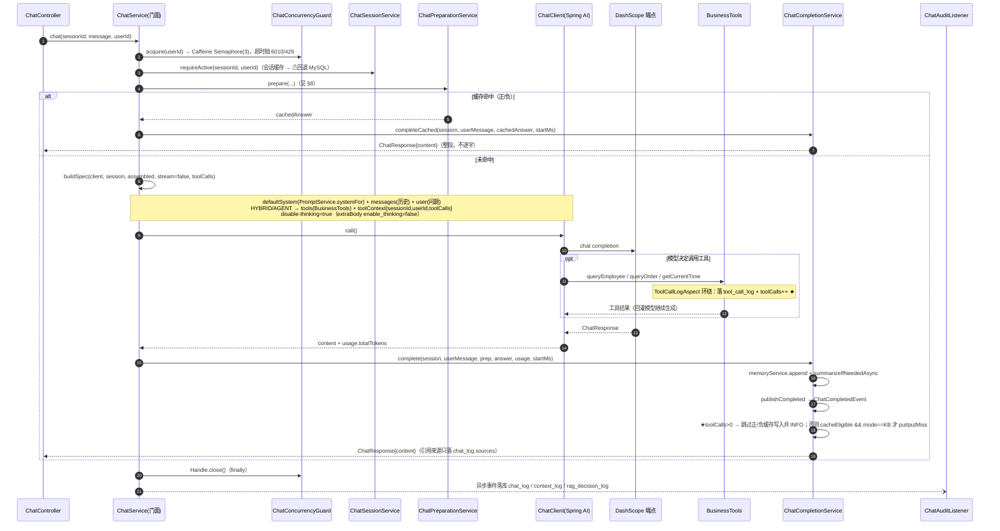
```mermaid
sequenceDiagram
    autonumber
    participant CT as ChatController
    participant CS as ChatService(门面)
    participant CG as ChatConcurrencyGuard
    participant SESS as ChatSessionService
    participant PP as ChatPreparationService
    participant CL as ChatClient(Spring AI)
    participant LLM as DashScope 端点
    participant BT as BusinessTools
    participant CC as ChatCompletionService
    participant AL as ChatAuditListener

    CT->>CS: chat(sessionId, message, userId)
    CS->>CG: acquire(userId) → Caffeine Semaphore(3)，超时抛 6010/429
    CS->>SESS: requireActive(sessionId, userId)（会话缓存 → ⚠回退 MySQL）
    CS->>PP: prepare(...)（见 §8）
    alt 缓存命中（正/负）
        PP-->>CS: cachedAnswer
        CS->>CC: completeCached(session, userMessage, cachedAnswer, startMs)
        CC-->>CT: ChatResponse{content}（整段，不逐字）
    else 未命中
        CS->>CS: buildSpec(client, session, assembled, stream=false, toolCalls)
        Note over CS,CL: defaultSystem(PromptService.systemFor) + messages(历史) + user(问题)<br/>HYBRID/AGENT → tools(BusinessTools) + toolContext{sessionId,userId,toolCalls}<br/>disable-thinking=true（extraBody enable_thinking=false）
        CS->>CL: call()
        CL->>LLM: chat completion
        opt 模型决定调用工具
            CL->>BT: queryEmployee / queryOrder / getCurrentTime
            Note over BT: ToolCallLogAspect 环绕：落 tool_call_log + toolCalls++ ★
            BT-->>CL: 工具结果（回灌模型继续生成）
        end
        LLM-->>CL: ChatResponse
        CL-->>CS: content + usage.totalTokens
        CS->>CC: complete(session, userMessage, prep, answer, usage, startMs)
        CC->>CC: memoryService.append + summarizeIfNeededAsync
        CC->>CC: publishCompleted → ChatCompletedEvent
        CC->>CC: ★toolCalls>0 → 跳过正/负缓存写入并 INFO；否则 cacheEligible && mode==KB 才 put/putMiss
        CC-->>CT: ChatResponse{content}（引用来源只落 chat_log.sources）
    end
    CS->>CG: Handle.close()（finally）
    CS--)AL: 异步事件落库 chat_log / context_log / rag_decision_log
```

---

## 10. 对话主链路 ③ 流式 SSE（含静默超时降级）

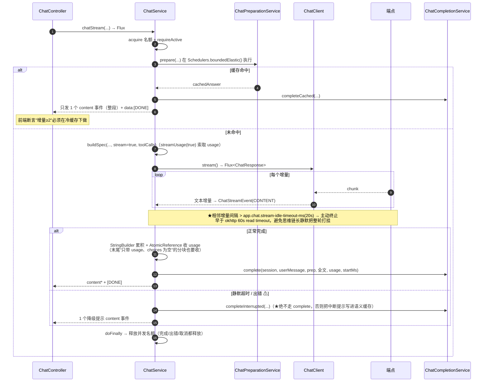
```mermaid
sequenceDiagram
    autonumber
    participant CT as ChatController
    participant CS as ChatService
    participant PP as ChatPreparationService
    participant CL as ChatClient
    participant LLM as 端点
    participant CC as ChatCompletionService

    CT->>CS: chatStream(...) → Flux
    CS->>CS: acquire 名额 + requireActive
    CS->>PP: prepare(...) 在 Schedulers.boundedElastic() 执行
    alt 缓存命中
        PP-->>CS: cachedAnswer
        CS->>CC: completeCached(...)
        CS-->>CT: 只发 1 个 content 事件（整段）+ data:[DONE]
        Note over CT: 前端断言"增量≥2"必须在冷缓存下做
    else 未命中
        CS->>CS: buildSpec(..., stream=true, toolCalls)（streamUsage(true) 索取 usage）
        CS->>CL: stream() → Flux<ChatResponse>
        loop 每个增量
            LLM-->>CL: chunk
            CL-->>CS: 文本增量 → ChatStreamEvent(CONTENT)
        end
        Note over CS,LLM: ★相邻增量间隔 > app.chat.stream-idle-timeout-ms(20s) → 主动终止<br/>早于 okhttp 60s read timeout，避免思维链长静默把整轮打挂
        alt 正常完成
            CS->>CS: StringBuilder 累积 + AtomicReference 收 usage<br/>（末尾"只带 usage、choices 为空"的分块也要收）
            CS->>CC: complete(session, userMessage, prep, 全文, usage, startMs)
            CS-->>CT: content* + [DONE]
        else 静默超时 / 出错 ⚠
            CS->>CC: completeInterrupted(...)（★绝不走 complete，否则把中断提示写进语义缓存）
            CS-->>CT: 1 个降级提示 content 事件
        end
        CS->>CS: doFinally → 释放并发名额（完成/出错/取消都释放）
    end
```

SSE 契约：只有 `event: content` 与结尾 `data:[DONE]`。阶段提示、思考流、来源事件均已从契约中移除（来源只落 `chat_log.sources`）。

---

## 11. 混合检索内部（`RagRetrievalService.retrieveOutcome`）

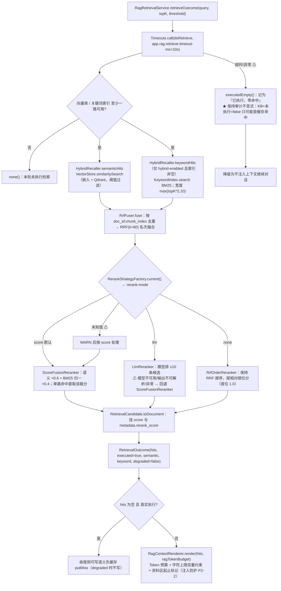
```mermaid
flowchart TD
    R0["RagRetrievalService.retrieveOutcome(query, topK, threshold)"] --> R3["Timeouts.call(doRetrieve, app.rag.retrieve-timeout-ms=10s)"]
    R3 --> R1{"向量库 / 关键词索引 至少一路可用?"}
    R1 -->|否| R2["none()：本轮未执行检索"]
    R1 -->|是| R4["HybridRecaller.semanticHits<br/>VectorStore.similaritySearch（嵌入 + Qdrant，阈值过滤）"]
    R1 -->|是| R5["HybridRecaller.keywordHits（仅 hybrid-enabled 且索引非空）<br/>KeywordIndex.search BM25；宽度 max(topK*2,10)"]
    R4 --> R6["RrfFuser.fuse：按 doc_id:chunk_index 去重 → RRF(k=60) 名次融合"]
    R5 --> R6
    R6 --> R7{"RerankStrategyFactory.current() ← rerank-mode"}
    R7 -->|score 默认| R8["ScoreFusionReranker：语义 ×0.6 + BM25 归一 ×0.4；单路命中直取该路分"]
    R7 -->|llm| R9["LlmReranker：模型排 ≤10 条候选<br/>⚠ 模型不可用/输出不可解析/异常 → 回退 ScoreFusionReranker"]
    R7 -->|none| R10["RrfOrderReranker：保持 RRF 顺序，赋相对顺位分（首位 1.0）"]
    R7 -->|"未知值 ⚠"| R11["WARN 后按 score 处理"]
    R8 --> R12["RetrievalCandidate.toDocument：挂 score 与 metadata.rerank_score"]
    R9 --> R12
    R10 --> R12
    R11 --> R8
    R12 --> R13["RetrievalOutcome(hits, executed=true, semantic, keyword, degraded=false)"]
    R3 -->|"超时/异常 ⚠"| R14["executedEmpty()：记为『已执行、零命中』<br/>★ 保持审计不变式：KB+未执行=false 只可能是缓存命中"]
    R14 --> R15["降级为不注入上下文继续对话"]
    R13 --> R16{"hits 为空 且 真实执行?"}
    R16 -->|是| R17["收尾侧可写语义负缓存 putMiss（degraded 时不写）"]
    R16 -->|否| R18["RagContextRenderer.render(hits, ragTokenBudget)<br/>Token 预算 + 字符上限双重约束 + 资料区起止标记（注入防护 P2-2）"]
```

**职责边界（2026-09 拆分）**：`RagRetrievalService` 只做编排与限时降级（176 行，原 564 行）；
召回在 `HybridRecaller`、融合在 `RrfFuser`、重排在 `RerankStrategy` 的三个实现、渲染在
`RagContextRenderer`，元数据口径集中在 `DocumentMeta`。接入真实重排模型（roadmap D3）＝新增一个
`RerankStrategy` 实现，`RerankStrategyFactory` 按 `mode()` 自动收录，编排层零改动。

阈值提醒：`similarity-threshold` 默认 0.45，该 embedding 模型分数量级偏低（正确块常 0.5~0.6），**上调到 0.6 会误杀正确答案**——调整前必须用 `/api/ai/rag/search` 看真实分布。

---

## 12. 上下文装配与 Token 预算（`ContextAssembler.assemble`）

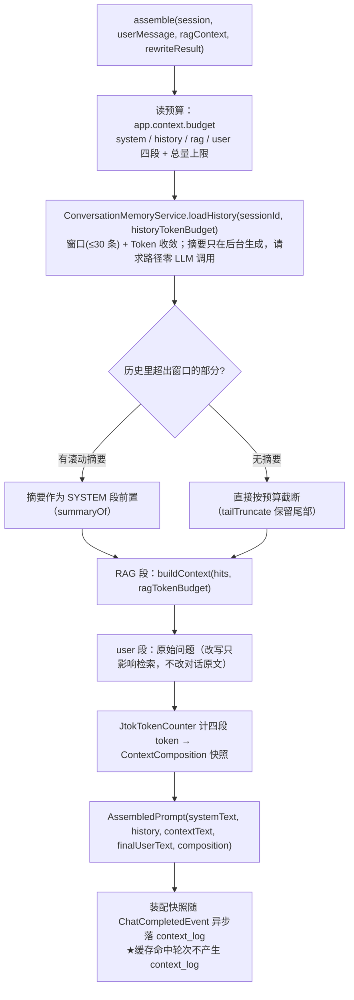
```mermaid
flowchart TD
    A0["assemble(session, userMessage, ragContext, rewriteResult)"] --> A1["读预算：app.context.budget<br/>system / history / rag / user 四段 + 总量上限"]
    A1 --> A2["ConversationMemoryService.loadHistory(sessionId, historyTokenBudget)<br/>窗口(≤30 条) + Token 收敛；摘要只在后台生成，请求路径零 LLM 调用"]
    A2 --> A3{"历史里超出窗口的部分?"}
    A3 -->|有滚动摘要| A4["摘要作为 SYSTEM 段前置（summaryOf）"]
    A3 -->|无摘要| A5["直接按预算截断（tailTruncate 保留尾部）"]
    A4 --> A6["RAG 段：buildContext(hits, ragTokenBudget)"]
    A5 --> A6
    A6 --> A7["user 段：原始问题（改写只影响检索，不改对话原文）"]
    A7 --> A8["JtokTokenCounter 计四段 token → ContextComposition 快照"]
    A8 --> A9["AssembledPrompt(systemText, history, contextText, finalUserText, composition)"]
    A9 --> A10["装配快照随 ChatCompletedEvent 异步落 context_log<br/>★缓存命中轮次不产生 context_log"]
```

口径：每条消息 +4 token（角色/分隔符），CL100K_BASE 对 qwen 是**偏保守近似**。改预算语义必须同步 `HeuristicTokenCounter` 的口径，否则历史段与 RAG 段会漂移。

---

## 13. 收尾阶段与缓存写入闸门（`ChatCompletionService`）

```mermaid
flowchart TD
    C0["complete(session, userMessage, prep, answer, usage, startMs)"] --> C1["memoryService.append(用户消息, 助手回答) → SPRING_AI_CHAT_MEMORY append-only"]
    C1 --> C2["summarizeIfNeededAsync(sessionId) 异步 auditExecutor"]
    C2 --> C3["sourceNames = ChatSourceDisplay.sourceNames(prep.sources) 去重去扩展名"]
    C3 --> C4["publishCompleted → ChatCompletedEvent（含 composition/usage/modelLabel）"]
    C4 --> G1{"★toolCalls.get() > 0 ?"}
    G1 -->|是| G2["跳过正缓存与负缓存 + INFO<br/>理由：答案含实时业务数据/个性化内容，而缓存条目跨用户共享"]
    G1 -->|否| G3{"prep.cacheEligible && rag.mode == KB ?"}
    G3 -->|否| G4["不写缓存"]
    G3 -->|是| G5{"declaresNoResult(answer) ?"}
    G5 -->|"是（\"未找到\"类回答）"| G6["putMiss 负缓存（短 TTL，防反复穿透）"]
    G5 -->|否| G7["put 正缓存 rag:answer:v{版本}:m{模型}:{摘要}"]
    G6 --> G8{"RetrievalOutcome.degraded ?"}
    G8 -->|是 ⚠| G9["不写负缓存（别把瞬时故障当无答案）"]
    G8 -->|否| G10["写"]
```

`completeCached` 只做记忆写回 + 审计（不再写缓存）；`completeInterrupted` 只做记忆与审计，**永不**触达缓存写入。

---

## 14. Agent 工具调用与切面

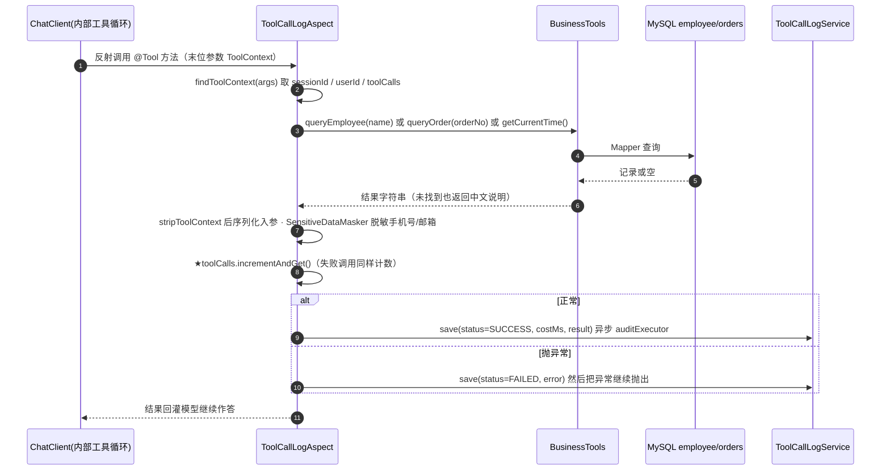
```mermaid
sequenceDiagram
    autonumber
    participant CL as ChatClient(内部工具循环)
    participant AO as ToolCallLogAspect
    participant BT as BusinessTools
    participant DB as MySQL employee/orders
    participant TL as ToolCallLogService

    CL->>AO: 反射调用 @Tool 方法（末位参数 ToolContext）
    AO->>AO: findToolContext(args) 取 sessionId / userId / toolCalls
    AO->>BT: queryEmployee(name) 或 queryOrder(orderNo) 或 getCurrentTime()
    BT->>DB: Mapper 查询
    DB-->>BT: 记录或空
    BT-->>AO: 结果字符串（未找到也返回中文说明）
    AO->>AO: stripToolContext 后序列化入参 · SensitiveDataMasker 脱敏手机号/邮箱
    AO->>AO: ★toolCalls.incrementAndGet()（失败调用同样计数）
    alt 正常
        AO->>TL: save(status=SUCCESS, costMs, result) 异步 auditExecutor
    else 抛异常
        AO->>TL: save(status=FAILED, error) 然后把异常继续抛出
    end
    AO-->>CL: 结果回灌模型继续作答
```

工具语义与缓存的耦合点：**KB 轮次一旦调用过工具，该轮答案禁止进入跨用户共享缓存**（§13 闸门）。新增工具或让工具参与 KB 作答时不得放宽。

---

## 15. 审计异步落库

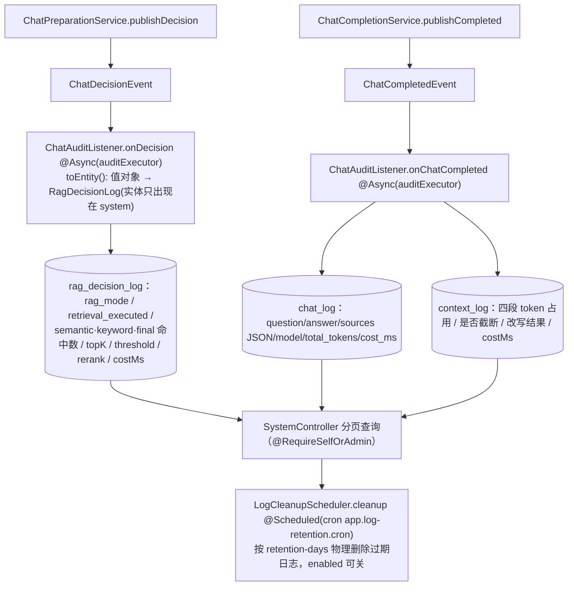
```mermaid
flowchart TD
    E1["ChatPreparationService.publishDecision"] --> Q1["ChatDecisionEvent"]
    E2["ChatCompletionService.publishCompleted"] --> Q2["ChatCompletedEvent"]
    Q1 --> L1["ChatAuditListener.onDecision @Async(auditExecutor)<br/>toEntity(): 值对象 → RagDecisionLog(实体只出现在 system)"]
    Q2 --> L2["ChatAuditListener.onChatCompleted @Async(auditExecutor)"]
    L1 --> T1[("rag_decision_log：rag_mode / retrieval_executed /<br/>semantic·keyword·final 命中数 / topK / threshold / rerank / costMs")]
    L2 --> T2[("chat_log：question/answer/sources JSON/model/total_tokens/cost_ms")]
    L2 --> T3[("context_log：四段 token 占用 / 是否截断 / 改写结果 / costMs")]
    T1 --> S1["SystemController 分页查询（@RequireSelfOrAdmin）"]
    T2 --> S1
    T3 --> S1
    S1 --> S2["LogCleanupScheduler.cleanup @Scheduled(cron app.log-retention.cron)<br/>按 retention-days 物理删除过期日志，enabled 可关"]
```

**审计不变式（可核对）**：`rag_mode=KB 且 retrieval_executed=false` ⟺ 该轮语义缓存命中，且该轮**没有** `context_log`。检索超时降级记 `executed=true`，所以不会混进来。

---

## 16. 会话管理与记忆 / 滚动摘要

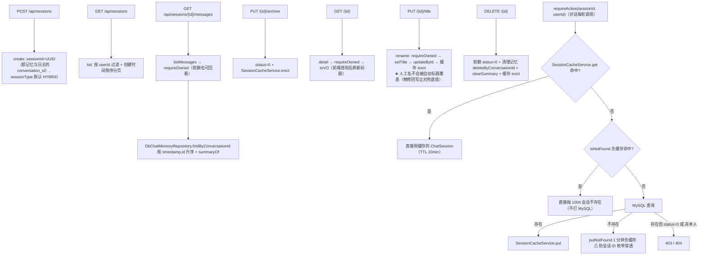
```mermaid
flowchart TD
    S1["POST /api/sessions"] --> S2["create: sessionId=UUID（即记忆与日志的 conversation_id）, sessionType 默认 HYBRID"]
    L1["GET /api/sessions"] --> L2["list: 按 userId 过滤 + 创建时间倒序分页"]
    M1["GET /api/sessions/{id}/messages"] --> M2["listMessages → requireOwned（软删也可回看）"]
    M2 --> M3["DbChatMemoryRepository.findByConversationId 按 timestamp,id 升序 + summaryOf"]
    A1["PUT /{id}/archive"] --> A2["status=0 + SessionCacheService.evict"]
    E1["GET /{id}"] --> E2["detail → requireOwned → toVO（前端首轮后刷新标题）"]
    N1["PUT /{id}/title"] --> N2["rename: requireOwned → setTitle → updateById → 缓存 evict<br/>★ 人工名不会被自动标题覆盖（精修回写比对兜底值）"]
    D1["DELETE /{id}"] --> D2["软删 status=0 + 清理记忆 deleteByConversationId + clearSummary + 缓存 evict"]
    R1["requireActive(sessionId, userId)（对话每轮调用）"] --> R2{"SessionCacheService.get 命中?"}
    R2 -->|是| R3["直接用缓存的 ChatSession（TTL 10min）"]
    R2 -->|否| R4{"isNotFound 负缓存命中?"}
    R4 -->|是| R5["直接抛 1004 会话不存在（不打 MySQL）"]
    R4 -->|否| R6["MySQL 查询"]
    R6 -->|存在| R7["SessionCacheService.put"]
    R6 -->|不存在| R8["putNotFound 1 分钟负缓存 ⚠ 防会话 ID 枚举穿透"]
    R6 -->|存在但 status=0 或 非本人| R9["403 / 404"]
```

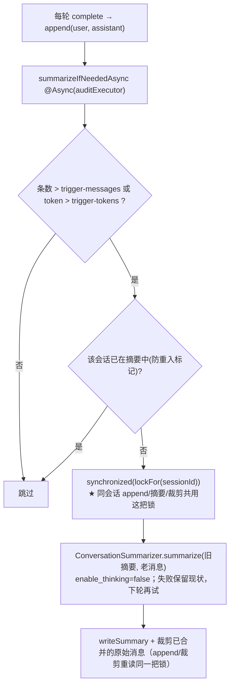
```mermaid
flowchart TD
    W1["每轮 complete → append(user, assistant)"] --> W2["summarizeIfNeededAsync @Async(auditExecutor)"]
    W2 --> W3{"条数 > trigger-messages 或 token > trigger-tokens ?"}
    W3 -->|否| W9["跳过"]
    W3 -->|是| W4{"该会话已在摘要中(防重入标记)?"}
    W4 -->|是| W9
    W4 -->|否| W5["synchronized(lockFor(sessionId))<br/>★ 同会话 append/摘要/裁剪共用这把锁"]
    W5 --> W6["ConversationSummarizer.summarize(旧摘要, 老消息)<br/>enable_thinking=false；失败保留现状，下轮再试"]
    W6 --> W7["writeSummary + 裁剪已合并的原始消息（append/裁剪重读同一把锁）"]
```

---

## 17. 前端调用映射（ai-agent-web）

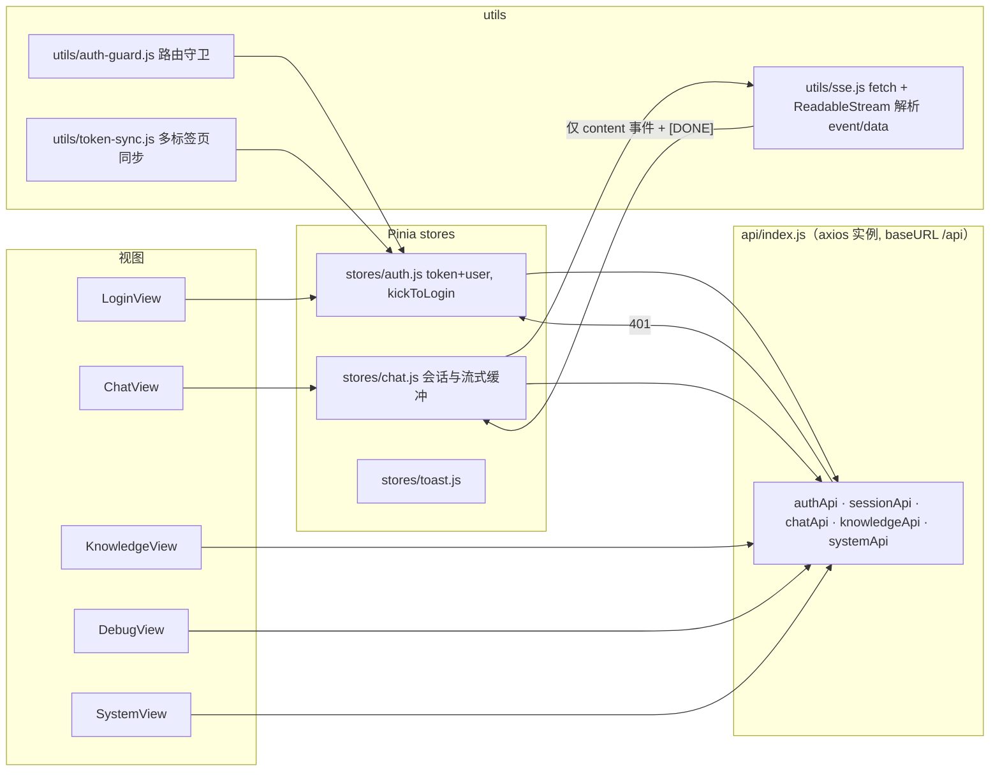
```mermaid
flowchart LR
    subgraph V["视图"]
        LV["LoginView"]
        CV["ChatView"]
        KV["KnowledgeView"]
        VV["DebugView"]
        SV["SystemView"]
    end
    subgraph ST["Pinia stores"]
        AS["stores/auth.js token+user, kickToLogin"]
        CH["stores/chat.js 会话与流式缓冲"]
        TS["stores/toast.js"]
    end
    subgraph UT["utils"]
        SSE["utils/sse.js fetch + ReadableStream 解析 event/data"]
        GUARD["utils/auth-guard.js 路由守卫"]
        TOKEN["utils/token-sync.js 多标签页同步"]
    end
    subgraph API["api/index.js（axios 实例, baseURL /api）"]
        AX["authApi · sessionApi · chatApi · knowledgeApi · systemApi"]
    end
    LV --> AS --> AX
    CV --> CH --> SSE
    CH --> AX
    KV --> AX
    VV --> AX
    SV --> AX
    GUARD --> AS
    TOKEN --> AS
    AX -->|"401"| AS
    SSE -->|"仅 content 事件 + [DONE]"| CH
```

前端只消费 `content` 事件（不消费 sources/阶段事件），与 §10 的 SSE 契约一致；`chatApi` 未调用同步接口的 `sources` 字段（契约已删）。

---

## 18. 降级与容错总表（全量出口）

| 触发点 | 故障 | 降级行为 | 日志 | 恢复方式 |
|---|---|---|---|---|
| `ChatClientProvider.getIfAvailable` | 无 API Key / 自动装配未启用 | 返回 null → `requireChatClient` 抛 `AI_NOT_CONFIGURED` 友好提示 | WARN | 配置密钥 |
| `ChatService.buildSpec → call/stream` | 模型 5xx / 网络 | 同步 502 语义化错误、不泄漏堆栈；流式走 `completeInterrupted` | WARN | 重试；`spring.ai.retry` 补瞬态失败 |
| `app.chat.stream-idle-timeout-ms` | 端点长静默（思维链） | 20s 主动终止 → 1 个降级 content 事件；★不写缓存 | WARN | 已默认 `disable-thinking=true` |
| `Timeouts.call(doRetrieve)` | 嵌入/Qdrant 挂起 | ≤10s 返回 `executedEmpty()`（已执行零命中）→ 不注入上下文继续答 | WARN | 端点恢复 |
| `VectorStore` 不可用 | Qdrant 故障 | 检索路返回空；入库置 `status=3` | WARN | 重启后向量集合仍在 |
| `KeywordIndex` 空 | 进程重启且重建未跑完 | 只走语义路（`keywordHits=0`） | INFO 重建耗时 | `KeywordIndexRebuilder` 自动重建 |
| 语义缓存读写 | Redis 不可用 | `get→null`、`isMiss→false`、`put/putMiss/evictAll` 忽略 | WARN（节流） | Redis 恢复 |
| 意图路由缓存 | Redis 不可用 | 按未命中走真实 `KeywordIntentRouter` | WARN（节流） | 同上 |
| 会话缓存 | Redis 不可用 | 回退 MySQL 查询（含 `isNotFound→false`） | WARN（节流） | 同上 |
| 令牌黑名单 | Redis 不可用 | dev 放行 / prod 拒绝（`blacklist-fail-open`） | WARN（节流） | 同上 |
| 登录限流 | Redis 不可用 | `isLocked→false`、`remainingLockMs→0`（★不冒成 500） | WARN（节流） | 同上；启动自检汇总 |
| `QueryRewriter.transform` | 端点劣化/超时 | 熔断（连续 2 次失败 → 60s 冷却零等待）+ 回退原问题 | WARN | 成功即复位 |
| `ConversationSummarizer` | 摘要失败 | 保留旧摘要，下轮再触发；装配层用"窗口+预算"兜底 | WARN | 自动 |
| `AuditListener` @Async 落库 | MySQL 抖动 | 只影响审计完整性，不影响回答 | WARN/ERROR | 重试下一轮 |
| `FileStorageService.delete` | 文件占用/权限 | 尽力而为，DB 记录与向量已清理 | WARN | 手工清理 |
| `evictAll` 向量清理失败 | Qdrant 不可用 | 记录日志并继续删除业务记录 | WARN | `reprocess` 或运维清理 |
| 解析超时 / 伪 ZIP | 恶意或超大文档 | `status=3` 中文 `error_message`；1002 拒绝 | INFO | — |
| `GlobalExceptionHandler` | 任何未捕获异常 | 5001 / HTTP 500，堆栈只进日志不出网 | ERROR | 唯一兜底，业务侧必须自己 catch |

---

## 19. 存储与键空间总览

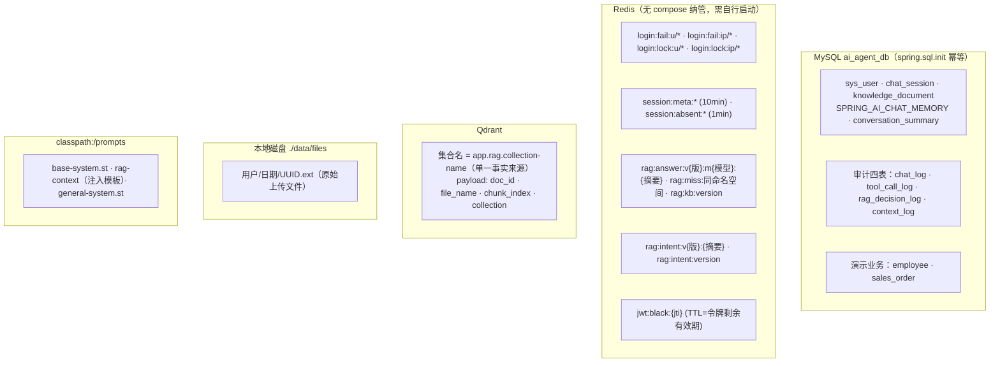
```mermaid
flowchart TD
    subgraph MY["MySQL ai_agent_db（spring.sql.init 幂等）"]
        M1["sys_user · chat_session · knowledge_document<br/>SPRING_AI_CHAT_MEMORY · conversation_summary"]
        M2["审计四表：chat_log · tool_call_log · rag_decision_log · context_log"]
        M3["演示业务：employee · sales_order"]
    end
    subgraph RD["Redis（无 compose 纳管，需自行启动）"]
        K1["login:fail:u/* · login:fail:ip/* · login:lock:u/* · login:lock:ip/*"]
        K2["session:meta:* (10min) · session:absent:* (1min)"]
        K3["rag:answer:v{版}:m{模型}:{摘要} · rag:miss:同命名空间 · rag:kb:version"]
        K4["rag:intent:v{版}:{摘要} · rag:intent:version"]
        K5["jwt:black:{jti} (TTL=令牌剩余有效期)"]
    end
    subgraph QD["Qdrant"]
        V1["集合名 = app.rag.collection-name（单一事实来源）<br/>payload: doc_id · file_name · chunk_index · collection"]
    end
    subgraph FS["本地磁盘 ./data/files"]
        F1["用户/日期/UUID.ext（原始上传文件）"]
    end
    subgraph PR["classpath:/prompts"]
        T1["base-system.st · rag-context（注入模板）· general-system.st"]
    end
```

删除会话 → 清 `SPRING_AI_CHAT_MEMORY` + `conversation_summary` + `session:meta:*`；文档变更 → `rag:kb:version` 自增使语义缓存整体换命名空间；改路由词表 → `rag:intent:version` 自增（或管理员 `DELETE /api/system/intent-cache`）。

---

## 20. 线程与异步模型

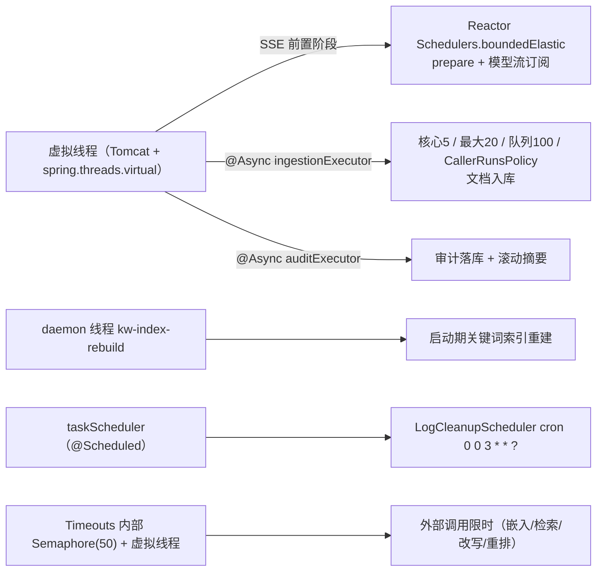
```mermaid
flowchart LR
    VT["虚拟线程（Tomcat + spring.threads.virtual）"] -->|"SSE 前置阶段"| BE["Reactor Schedulers.boundedElastic<br/>prepare + 模型流订阅"]
    VT -->|"@Async ingestionExecutor"| IE["核心5 / 最大20 / 队列100 / CallerRunsPolicy<br/>文档入库"]
    VT -->|"@Async auditExecutor"| AE["审计落库 + 滚动摘要"]
    RT["daemon 线程 kw-index-rebuild"] --> KI["启动期关键词索引重建"]
    TS["taskScheduler（@Scheduled）"] --> JOB["LogCleanupScheduler cron 0 0 3 * * ?"]
    TO["Timeouts 内部 Semaphore(50) + 虚拟线程"] --> EXT["外部调用限时（嵌入/检索/改写/重排）"]
```

约束：`@Async` 必须显式指定执行器名（多个 TaskExecutor 时 Spring 会报 bean 歧义）；`configureAsyncSupport` 用 Boot 的 `applicationTaskExecutor`（虚拟线程）承载 SSE。

---

## 21. 端到端验证脚本对应关系

| e2e 段 | 覆盖的上面的图 | 关键断言 |
|---|---|---|
| 段 1 | §4/§5 | 注册/登录 + `DELETE /api/system/semantic-cache` 建冷缓存基线 |
| 段 2 | §16 | 创建会话 / 列表 / 归档 |
| 段 3 | §8~§13 | 多轮问答（含工具轮次与指代改写） |
| 段 4 | §10 | SSE 增量 ≥2（必须冷缓存） |
| 段 5 | §4/§15 | 日志接口越权改写 |
| 段 6 | §13/§8 | 缓存命中（回答逐字一致、无新增 `context_log`、`KB+未检索` 留痕） |
| 段 7 | §6/§7 | 知识库增删 → 版本自增联动失效 |
| 段 8 | §18 | 异常路径（参数、越权、404） |

---

## 22. 画图过程中发现的偏差（已按代码实况记录，未擅自改行为）

| # | 事实（代码为准） | 与既有描述/预期的差异 | 建议 |
|---|---|---|---|
| 1 | 上传与批量上传端点**只有 JWT**，`KnowledgeController` 上无任何 `@Require*` | 知识库是全公司共享语料，任何登录用户都能写入并消耗 Embedding 成本；`AGENTS.md` 只说"删除/重处理已挂 @RequireAdmin"（确实如此），未覆盖上传 | 若产品定位是"仅管理员维护语料"，给 `upload`/`uploadBatch` 加 `@RequireAdmin`；否则至少落地 roadmap A3 上传配额 |
| 2 | `@RequireAdmin` 挂在 **Service 方法**（`KnowledgeDocumentService:183,204`），其它管理动作挂在 Controller（`SystemController:153,165`） | 风格不一致（切面对两者都生效，功能无差异），但从 Controller 看不出鉴权 | 统一到 Controller 层，或在 `AGENTS.md` 明确"允许挂 Service" |
| 3 | ~~`AGENTS.md` 错误码行写"1001~5002, 用户相关 6001~6005"~~ | 与实际枚举不符 | **已校准（本批）**：按 `ErrorCode` 枚举实测重写 |
| 4 | `README` §6 曾写"本期仅后端，前端为下一迭代" | 独立仓库 `ai-agent-web` 已存在（Vue3+Vite+Pinia，无组件库） | 本次已改为实况描述 |
| 5 | `README` 写 e2e"52 项断言" | 脚本里 `check(` 出现 55 处（含定义），roadmap 09-18 记录为 53 | 未跑 e2e 前不下结论，待实测后统一数字 |

---

方法级说明（每个类每个方法做什么、被谁调用）见 **[method-map.md](method-map.md)**。
